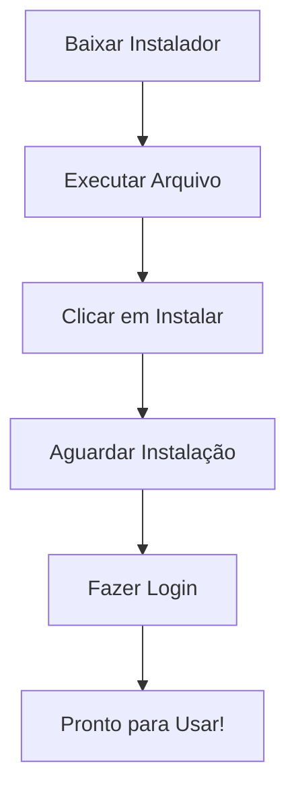

<!-- Título -->
# Instalando o Git Desktop

***Conteúdo da Aula:***

Aula teórica.

## :memo: Explicação do Processo

### O que este tutorial faz?

Ensina como instalar o GitHub Desktop, uma ferramenta que ajuda programadores a gerenciar códigos e projetos.

### Vocabulário Básico:

- `Git` &#8594; Sistema de controle de versão (como um diário de mudanças para códigos).
- `GitHub Desktop` &#8594; Programa que facilita usar o Git sem comandos complexos.
- `Repositório` &#8594; Pasta onde ficam os arquivos de um projeto.

### Passo a Passo da Instalação:

1. **Baixar o Instalador**
   - Acesse o site oficial: <https://desktop.github.com/>.
   - Clique em "Download for Windows" (ou Mac, dependendo do seu computador).
   - É como baixar um aplicativo novo no celular.

2. **Iniciar Instalação**
   - Abra o arquivo baixado.
   - Clique em "Próximo/Instalar".
   - Aguarde alguns minutos.
   - É como montar um quebra-cabeça: só seguir os passos.

3. **Configuração Inicial**
   - Quando abrir, vai pedir para fazer login no GitHub.
   - Se não tiver conta, crie gratuitamente.
   - Pense como criar um perfil em uma rede social.

### Diagrama de Instalação

### Cuidado!

- Tenha conexão com internet durante a instalação
- Verifique se tem espaço no computador
- Feche outros programas durante a instalação

<!-- > [!IMPORTANT]\
> **Boas práticas**:
>

---

> [!WARNING]\
> **Recomendações**:
>

---

> [!NOTE]\
> **Observações**:
>

--- -->

<!-- ### :clipboard: Próximos Passos -->

### :bulb: Dicas do Especialista

- Domine o Git não apenas instalando, mas praticando.
- Cada commit é uma história do seu código!

### :bookmark: Tags

`#GitHubDesktop` `#Instalação` `#ControleDeVersão` `#Programação`

<!-- Informações -->
### &#8505; Informações

&nbsp;

&nbsp;

&nbsp;

&nbsp;

&nbsp;

&nbsp;

